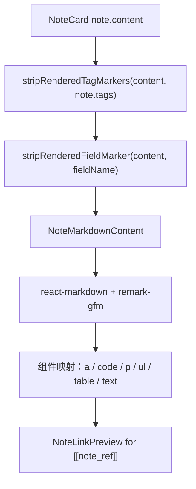

# r017-note-card-markdown-rendering 设计文档

日期：2026-06-12

需求澄清文档：`docs/request-clarify/home-ui/r017-note-card-markdown-rendering.md`

## 核心功能（WHAT）

首页 NoteCard 展示态需要从普通文本渲染升级为 GFM Markdown 渲染。用户保存的 `note.content` 仍然是原始文本，前端在展示态通过成熟 Markdown renderer 输出语义化内容，同时保留 Zembra 现有的 tag、field 和 note 双链能力。

### 需求背景（WHY）

当前 NoteCard 使用 `
` 容器渲染正文，并把内容拆成普通文本 `` 与 `NoteLinkPreview`。这条链路只支持 `[[note_ref]]` 双链，不支持 Markdown AST，因此 `- item`、引用、表格、强调和行内代码等内容都会按普通文本显示。

用户已确认本需求作为新功能处理：

- 使用 GFM。
- 引入成熟 renderer，避免重复造轮子。
- 不渲染原始 HTML。
- Markdown 链接可点击并新窗口打开。
- 只做行内代码高亮样式，不做完整代码段语法高亮。

### 需求目标（GOAL）

- NoteCard 展示态按 GFM 渲染正文，不针对某个截图或单个 case 特判。
- 保留现有 `@field` metadata、`#tag` chip 和 `[[note_ref]]` 双链预览能力。
- 保持折叠 / 展开逻辑可用，Markdown 内容不破坏卡片布局。
- 新增依赖仅服务 Markdown 渲染，不改变后端 API、数据库契约或数据访问边界。

### 范围边界

| 类型 | 内容 |
| --- | --- |
| In Scope | NoteCard 展示态 GFM Markdown 渲染 |
| In Scope | 引入成熟 Markdown renderer，推荐 `react-markdown` + `remark-gfm` |
| In Scope | 禁止原始 HTML 作为 HTML 注入页面 |
| In Scope | Markdown 外链新窗口打开并设置安全 `rel` |
| In Scope | 行内代码使用当前视觉 token 做高亮样式 |
| In Scope | `[[note_ref]]` 继续渲染为短链按钮并支持 hover preview |
| In Scope | 已独立展示的 `@field`、`#tag` marker 继续从正文移除 |
| In Scope | 自动化测试覆盖 Markdown 语义渲染、双链、HTML 禁用、marker 去重和外链行为 |
| Out of Scope | Markdown 编辑器、编辑态实时预览、富文本编辑器 |
| Out of Scope | 后端存储格式、API 契约或 schema 变更 |
| Out of Scope | 自研 Markdown parser 或某条 note 的特判逻辑 |
| Out of Scope | 完整代码段语法高亮库 |

## 实现流程（HOW）

### 依赖选择

| 依赖 | 用途 | 约束 |
| --- | --- | --- |
| `react-markdown` | 将 Markdown AST 映射为 React 组件 | 只在展示态使用，不进入编辑器或数据层 |
| `remark-gfm` | 支持 GFM 表格、任务列表、删除线等语法 | 不改变 `note.content` 存储格式 |

不引入 `rehype-raw`。原始 HTML 由 renderer 按默认安全策略处理，不作为 HTML 注入页面。

### 渲染链路

### 组件拆分

| 文件 | 设计 |
| --- | --- |
| `src/pages/home/NoteCard.tsx` | 保留卡片状态、操作菜单、编辑态切换和折叠逻辑；展示态改为调用 Markdown renderer 组件。 |
| `src/pages/home/NoteMarkdownContent.tsx` | 新建展示组件，负责 GFM renderer、组件映射、外链策略、行内代码样式和双链 inline 渲染。 |
| `src/pages/home/homeUtils.ts` | 复用现有 `parseRenderableNoteContent()`、`formatShortNoteRef()` 等纯函数；必要时补充小型纯函数，但不写 Markdown parser。 |
| `src/styles/main.css` | 如 Tailwind 原子类不足以稳定覆盖 Markdown 子节点，可补少量 `.note-markdown` 全局样式，使用现有 CSS token。 |
| `src/pages/home/HomePage.test.tsx` | 增加用户可观察行为测试。 |
| `src/pages/home/homeUtils.test.ts` | 保留或补充双链解析相关纯函数测试。 |

### `NoteMarkdownContent` 接口

| 参数 | 类型 | 说明 |
| --- | --- | --- |
| `content` | `string` | 已完成 tag / field marker 去重后的 Markdown 文本。 |
| `onLoadNotePreview` | `(noteRef: string) => Promise<NoteDto>` | 传给 `NoteLinkPreview` 的预览加载函数。 |

`NoteLinkPreview` 建议从 `NoteCard.tsx` 内部组件提升为可复用组件，或与 `NoteMarkdownContent` 放在同文件中由 NoteCard 引入。它仍只负责短链按钮、hover / focus 预览和错误兜底。

### 双链处理策略

Markdown renderer 负责标准 Markdown；`[[note_ref]]` 是 Zembra 自定义 inline token。实现时不要在 renderer 外手写整套 Markdown 解析，可通过自定义 text renderer 对文本节点调用 `parseRenderableNoteContent()`，只把匹配到的 `[[32位hex]]` 替换为 `NoteLinkPreview`，其余文本原样返回。

这样可以保留成熟 Markdown renderer 的 block / inline 解析能力，同时只在自定义 token 层处理 Zembra 双链。

### Markdown 组件映射

| Markdown 节点 | 渲染策略 |
| --- | --- |
| `a` | `target="_blank"`，`rel="noreferrer"`，使用 accent 文本样式。 |
| `code` inline | 使用当前 surface-muted / border / text token 做行内高亮。 |
| `code` block | 按普通 pre/code 结构展示，不引入语法高亮库。 |
| `ul` / `ol` | 使用正常列表语义，缩进和间距适配卡片宽度。 |
| `blockquote` | 使用左边框或轻量背景表达引用，不新增卡片嵌套。 |
| `table` | 放入横向可滚动容器，避免窄卡片撑破布局。 |
| `input[type="checkbox"]` | 任务列表只读展示，避免用户误以为可直接编辑。 |

### 折叠和布局

当前折叠逻辑基于 `contentRef.scrollHeight > clientHeight`。Markdown 渲染后内容高度来自多种 block 节点，因此 `contentRef` 类型需要从 `HTMLParagraphElement` 调整为 `HTMLDivElement`，展示态容器从 `
` 改为 `
`。

折叠容器继续由 NoteCard 控制：

- 未展开时设置现有最大高度。
- 展开时移除最大高度。
- Markdown 子节点不使用会改变卡片宽度的固定尺寸。
- 表格使用内部滚动而不是撑开 NoteCard。

### 安全策略

- 不引入 `rehype-raw`，不把原始 HTML 注入 DOM。
- 外链打开新窗口，并设置 `rel="noreferrer"`。
- 不记录 note content 到日志。
- 不改变任何后端 API 请求体或响应体。

### 依赖约束对齐

`react-markdown` 和 `remark-gfm` 属于展示层依赖，不属于数据库、ORM、migration、Supabase 查询或重型 UI 套件。实现时需要更新 `package.json` 和 lockfile，并在 PR 或提交说明中说明该依赖只用于 NoteCard 展示态 Markdown renderer。

## 测试用例

| 类型 | 用例 |
| --- | --- |
| 单元 / 组件测试 | NoteCard 渲染 `- item` 时出现语义化 list / listitem。 |
| 单元 / 组件测试 | `**bold**`、`*italic*`、`~~delete~~` 渲染为对应语义节点。 |
| 单元 / 组件测试 | `[label](https://example.com)` 渲染为链接，具备 `_blank` 与 `noreferrer`。 |
| 单元 / 组件测试 | HTML 输入不作为 HTML 节点插入页面。 |
| 单元 / 组件测试 | 行内代码渲染为 `code` 节点。 |
| 单元 / 组件测试 | `[[note_ref]]` 继续显示短链按钮，并保留 hover preview。 |
| 单元 / 组件测试 | `@field` / `#tag` marker 不在正文重复出现。 |
| 回归检查 | 编辑态仍显示原始 Markdown 文本，提交 payload 不改变。 |
| 编译检查 | `npm run build` 通过。 |
| 自动化测试 | `npm run test` 通过。 |
| 手工检查 | 访问 `http://localhost:5173/`，确认列表、链接、行内代码、双链预览和折叠展开行为正常。 |
