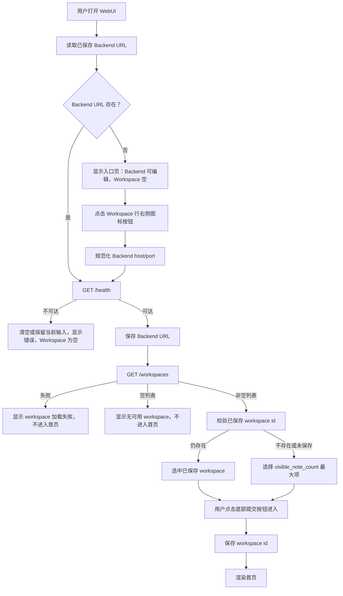

# r018-login-workspace-selector 设计文档

日期：2026-06-26

需求澄清文档：`docs/request-clarify/home-ui/r018-login-workspace-selector.md`

## 核心功能（WHAT）

在现有登录入口增加 workspace 选择能力。用户仍在同一个居中窄表单内输入 Backend host 和 port；表单下方新增固定存在的 Workspace 下拉条。未连接后端时，Workspace 下拉条为空且不可用；用户点击 Workspace 下拉条右侧的图标按钮后，前端使用当前 Backend 输入执行连通性检查，并在通过后调用 `GET /workspaces` 加载可用 workspace。下拉条展示 workspace 列表并默认选中笔记数量最多的一项；用户通过底部提交按钮确认选中的 workspace 并进入首页。

### 需求背景（WHY）

引入 workspace id 后，笔记相关 API 请求必须携带明确的 workspace scope。当前前端在没有 `VITE_ZEMBRA_WORKSPACE_ID` 时会自动调用 `GET /workspaces` 并取第一项作为默认 workspace，这会把 workspace 选择隐藏在 API client 内部。新的入口设计需要让用户在进入首页前明确选择 workspace，同时保持当前登录页的轻量结构，不破坏现有 Backend URL 门禁和居中表单布局。

### 需求目标（GOAL）

用户打开 WebUI 后，可以在同一入口页完成 Backend 连接和 workspace 选择。系统能持久化用户选择的 workspace id，后续访问时校验该 workspace 是否仍存在；存在则默认选中并允许进入首页，不存在则清空选择并留在入口页要求用户重新选择。所有首页笔记请求都使用当前选中的 workspace id。

### 范围边界

| 范围 | 设计结论 |
| --- | --- |
| Backend URL 输入 | 保留当前 host + port 两个输入框，不改为单一 URL 输入。 |
| Workspace 控件 | 新增一个 Workspace label 和一个与 Backend 输入区域同宽的下拉条。 |
| Workspace 图标按钮 | 放在 Workspace 下拉条右侧，只负责检查当前 Backend 并调用 `GET /workspaces` 加载或刷新 workspace 列表。 |
| 底部提交按钮 | 保留当前表单底部提交按钮，用于在选中 workspace 后保存 workspace id 并进入首页。 |
| Workspace 数据源 | 使用 `GET /workspaces`，消费现有 `ListWorkspacesResponse`。 |
| 默认选择 | 无有效持久化选择时，选择 `visible_note_count` 最大的 workspace。 |
| 持久化 | 使用 `localStorage` 保存选中的 `workspace_id`。 |
| 失效处理 | 已保存 workspace 不在最新列表中时清空本地选择，停留入口页让用户重新选择。 |
| 空列表处理 | `GET /workspaces` 返回空列表时不进入首页。 |
| 首页内切换 | 本轮不在首页增加 workspace 切换器。 |
| Workspace 管理 | 本轮不实现创建、重命名、删除 workspace。 |

## 实现流程（HOW）

### 当前架构触点

| 模块 | 当前责任 | 本设计调整 |
| --- | --- | --- |
| `src/app/BackendUrlGate.tsx` | 管理 Backend URL 门禁、渲染登录入口、通过后渲染 children | 扩展为 Backend + Workspace 两段式门禁，在同一表单内管理 workspace 加载、选择、确认和错误状态。 |
| `src/api/backendConfig.ts` | 管理 Backend URL 本地存储、URL 规范化和 `GET /health` 可达性检查 | 增加 workspace id 本地存储 helper，或新增同级配置模块承载 workspace 选择存储。 |
| `src/api/client.ts` | 创建默认 notes、taxonomy、sync client；当前会在无环境 workspace id 时自动取 `/workspaces` 第一项 | 改为默认 notes client 从已保存 workspace id 获取 scope；不再在 API client 内部静默选择第一项。 |
| `src/api/types.ts` | 已定义 `WorkspaceSummary` 和 `ListWorkspacesResponse` | 保持类型复用，必要时增加前端展示 DTO 或工具函数类型。 |
| `src/api/http.ts` | 提供 `requestJson`、错误解析和 URL 拼接 | 继续复用，用于 `GET /workspaces`。 |
| `src/features/notes/noteStore.ts` | 首页加载 recent notes、daily counts、CRUD 和 note preview | 不直接管理 workspace 选择，只消费默认 notes client 当前 scope。 |

### 状态模型

入口页状态建议按 Backend 与 Workspace 两个维度建模，避免把 “checking”、“ready”、“needs-url” 继续扩成难读的单一字符串。实现时可以使用联合类型，但行为必须覆盖下表。

| 状态 | Backend 输入 | Workspace 下拉 | Workspace 右侧图标按钮 | 底部提交按钮 | 页面去向 |
| --- | --- | --- | --- | --- | --- |
| 未连接后端 | 可编辑 | 空、不可选 | 可点击，执行 Backend 可达性检查并加载 workspace | 禁用 | 留在入口页 |
| 正在检查后端 | 可见，建议禁用 | 空、不可选 | 禁用或显示加载态 | 禁用 | 留在入口页 |
| 后端可达，正在加载 workspace | 可见 | 空、不可选 | 禁用或显示加载态 | 禁用 | 留在入口页 |
| 后端可达，workspace 已加载 | 可见 | 可选，默认值已计算 | 可点击，重新检查 Backend 并刷新 workspace 列表 | 可点击，保存 workspace 并进入首页 | 进入首页 |
| workspace 下拉展开 | 可见 | 可选，显示完整选项列表 | 可点击，刷新 workspace 列表 | 可点击，保存当前选中项并进入首页 | 留在入口页或进入首页 |
| workspace 空列表 | 可见 | 空、不可选 | 可点击，重试加载 workspace 列表 | 禁用 | 留在入口页 |
| workspace 加载失败 | 可见 | 空、不可选 | 可点击，重试连接和加载流程 | 禁用 | 留在入口页 |
| 已保存 workspace 失效 | 可见 | 按最新列表重新选择或为空 | 可点击，刷新 workspace 列表 | 有可用 workspace 时可点击，否则禁用 | 留在入口页 |

### UI 布局设计

登录入口继续使用当前 `main` 居中布局和 `section max-w-[420px]` 的窄表单结构。表单内容保持从上到下排列：标题说明、Backend label、Backend 输入行、Workspace label、Workspace 选择行、提示或错误区域、底部提交按钮。Backend 与 Workspace 对应的主框宽度必须一致；右侧图标按钮只属于 Workspace 行，只用于调用 `GET /workspaces` 加载或刷新 workspace 列表。Backend 行严格禁止增加箭头按钮。底部提交按钮保留为进入首页的确认动作。

```text
状态 A：尚未连接后端，workspace 下拉为空

┌──────────────────────────────────────────────┐
│ Zembra                                       │
│ 输入你的 Zembra backend 地址，通过连通性检查 │
│ 后选择 workspace。                           │
│                                              │
│ Backend                                      │
│ ┌──────────────────────────┐ ┌────────────┐ │
│ │ IP / Host                │ │ Port       │ │
│ └──────────────────────────┘ └────────────┘ │
│                                              │
│ Workspace                                    │
│ ┌────────────────────────────────────┐ ┌───┐ │
│ │                                    │ │ ↻ │ │
│ └────────────────────────────────────┘ └───┘ │
│                                              │
│ 错误提示区域                                 │
│                                              │
│ [ 进入 Zembra ]                              │
└──────────────────────────────────────────────┘
```

```text
状态 B：后端可达，workspace 已加载

┌──────────────────────────────────────────────┐
│ Zembra                                       │
│ 输入你的 Zembra backend 地址，通过连通性检查 │
│ 后选择 workspace。                           │
│                                              │
│ Backend                                      │
│ ┌──────────────────────────┐ ┌────────────┐ │
│ │ 127.0.0.1                │ │ 3000       │ │
│ └──────────────────────────┘ └────────────┘ │
│                                              │
│ Workspace                                    │
│ ┌────────────────────────────────────┐ ┌───┐ │
│ │ 产品笔记                      128 │ │ ↻ │ │
│ └────────────────────────────────────┘ └───┘ │
│                                              │
│ 提示或错误区域                               │
│                                              │
│ [ 进入 Zembra ]                              │
└──────────────────────────────────────────────┘
```

```text
状态 C：workspace 下拉展开

┌──────────────────────────────────────────────┐
│ Zembra                                       │
│ 输入你的 Zembra backend 地址，通过连通性检查 │
│ 后选择 workspace。                           │
│                                              │
│ Backend                                      │
│ ┌──────────────────────────┐ ┌────────────┐ │
│ │ 127.0.0.1                │ │ 3000       │ │
│ └──────────────────────────┘ └────────────┘ │
│                                              │
│ Workspace                                    │
│ ┌────────────────────────────────────┐ ┌───┐ │
│ │ 产品笔记                      128 │ │ ↻ │ │
│ ├────────────────────────────────────┤ └───┘ │
│ │ 产品笔记                      128 │       │
│ │ 9f2a81bc                       24 │       │
│ │ Research                        0 │       │
│ └────────────────────────────────────┘       │
│                                              │
│ 提示或错误区域                               │
│                                              │
│ [ 进入 Zembra ]                              │
└──────────────────────────────────────────────┘
```

```text
状态 D：后端可达，但没有可用 workspace

┌──────────────────────────────────────────────┐
│ Zembra                                       │
│ 输入你的 Zembra backend 地址，通过连通性检查 │
│ 后选择 workspace。                           │
│                                              │
│ Backend                                      │
│ ┌──────────────────────────┐ ┌────────────┐ │
│ │ 127.0.0.1                │ │ 3000       │ │
│ └──────────────────────────┘ └────────────┘ │
│                                              │
│ Workspace                                    │
│ ┌────────────────────────────────────┐ ┌───┐ │
│ │                                    │ │ ↻ │ │
│ └────────────────────────────────────┘ └───┘ │
│                                              │
│ 没有可用 workspace，不能进入首页。           │
│                                              │
│ [ 进入 Zembra ]                              │
└──────────────────────────────────────────────┘
```

### 宽度与响应式策略

| 元素 | 宽度策略 |
| --- | --- |
| 外层 section | 继续使用当前 `w-full max-w-[420px]`。 |
| Backend 行 | 保持当前两列结构，host 输入占剩余空间，port 输入保留固定宽度。 |
| Workspace 行 | 使用与 Backend 行相同的总宽度区域，左侧下拉占据主区域，右侧图标按钮固定宽度。 |
| Workspace 主框 | 主框视觉宽度必须与 Backend 输入组合的主视觉宽度对齐，避免下拉比 Backend 行明显更短或更长。 |
| Workspace 图标按钮 | 固定正方形或近似正方形尺寸，表达加载或刷新 workspace 列表，文本通过 `aria-label` 提供。 |
| 底部提交按钮 | 保持当前整行按钮形态，用于确认选中 workspace 并进入首页；没有可用 workspace 时禁用。 |
| 长 workspace 名 | 单行截断，右侧 note count 保持可见。 |
| 移动宽度 | 仍保持单列居中表单，不把 Backend host 和 port 拆到不一致的宽度体系中；如宽度不足，优先缩短 port 宽度或整体 grid，而不是让文本换行。 |

### Workspace 展示规则

| 数据 | 展示规则 |
| --- | --- |
| `workspace_name` 非空 | 展示 `workspace_name`。 |
| `workspace_name` 为空 | 展示 `workspace_id.slice(0, 8)`。 |
| `short_hash` | 只作为后备参考；前端显示前八位 hash 的规则以 `workspace_id` 为准。 |
| `visible_note_count` | 在选项右侧展示，用数字原文即可。 |
| 排序 | 下拉选项默认沿用后端返回顺序；默认选中逻辑独立按最大 `visible_note_count` 计算。 |
| 并列最大值 | 多个 workspace 笔记数相同时，选中后端返回顺序中最靠前的一项。 |

### 数据流



### 本地存储设计

| 配置项 | 建议 key | 读写责任 |
| --- | --- | --- |
| Backend URL | `zembra.backendBaseUrl` | 继续由 `backendConfig.ts` 管理。 |
| Workspace ID | `zembra.workspaceId` | 由 API 配置层或新增 workspace 配置 helper 管理。 |

Workspace ID 只保存 `workspace_id`，不保存 workspace name 和 note count，避免展示数据过期。每次进入入口页都以 `GET /workspaces` 的最新结果校验已保存 id。保存 id 失效时删除 `zembra.workspaceId`，页面停留在入口页，并根据最新列表选择默认项或显示空状态。

### API Client 设计

当前 `createDefaultNotesClient()` 在没有 `VITE_ZEMBRA_WORKSPACE_ID` 时会调用 `/workspaces` 并缓存第一项。该逻辑需要改为优先使用环境变量，其次使用本地保存的 workspace id。如果两者都没有，notes client 在被调用时应抛出明确错误，实际正常路径由 `BackendUrlGate` 保证进入首页前已经保存 workspace id。

| 场景 | notes client workspace scope |
| --- | --- |
| `VITE_ZEMBRA_WORKSPACE_ID` 存在 | 使用环境变量，保持开发或部署覆盖能力。 |
| 环境变量为空且本地保存 workspace id 存在 | 使用本地保存值。 |
| 环境变量为空且本地没有 workspace id | 抛出明确错误，不在 client 内部静默选第一项。 |

`GET /workspaces` 建议单独封装为 workspace client 或入口页 helper，避免把 workspace 列表能力塞进 notes client。这样 notes client 继续只负责 note CRUD 和 note list scope，入口页负责 workspace 选择体验。

### 错误处理与日志

| 场景 | UI 行为 | 日志 |
| --- | --- | --- |
| Backend 不可达 | Workspace 下拉清空并禁用，显示不可达错误。 | `console.warn` 记录 normalized backend URL 和失败上下文。 |
| Workspace 加载失败 | 不进入首页，显示加载失败提示，Workspace 右侧图标按钮允许重试。 | `console.warn` 记录 backend URL 和错误对象。 |
| Workspace 空列表 | 不进入首页，显示没有可用 workspace。 | `console.info` 记录 workspace count 为 0。 |
| 已保存 workspace 失效 | 删除本地 workspace id，停留入口页。 | `console.warn` 记录 saved workspace id 已失效，禁止记录敏感信息。 |
| 进入首页成功 | 保存 workspace id 后渲染 children。 | `console.info` 记录 workspace id 前八位或 workspace count，避免输出不必要长日志。 |

### 可访问性设计

| 元素 | 设计 |
| --- | --- |
| Backend host 输入 | 保留可访问名称 `IP / Host`。 |
| Backend port 输入 | 保留可访问名称 `Port`。 |
| Workspace 下拉 | 使用可访问名称 `Workspace`。 |
| Workspace 图标按钮 | 使用 `aria-label` 表达“加载 workspace”或“刷新 workspace”。 |
| 底部提交按钮 | 使用可见文案表达“进入 Zembra”。 |
| 错误提示 | 使用 `role="alert"`，复用当前错误提示模式。 |
| 禁用态 | 无 workspace 或正在加载时禁用不能完成的动作。 |

## i18n

本需求涉及 `common` namespace 下 `backend.login` 文案扩展。三种语言资源需要保持 key 完整，测试继续覆盖资源一致性。

| key | zh-CN | en-US | zh-TW |
| --- | --- | --- | --- |
| `backend.login.description` | 输入你的 Zembra backend 地址，通过连通性检查后选择 workspace。 | Enter your Zembra backend address, then choose a workspace after the connection check. | 輸入你的 Zembra backend 位址，通過連線檢查後選擇 workspace。 |
| `backend.login.workspaceLabel` | Workspace | Workspace | Workspace |
| `backend.login.workspacePlaceholder` | 请选择 workspace | Select a workspace | 請選擇 workspace |
| `backend.login.loadWorkspacesAction` | 加载 workspace | Load workspaces | 載入 workspace |
| `backend.login.refreshWorkspacesAction` | 刷新 workspace | Refresh workspaces | 重新整理 workspace |
| `backend.login.enterAction` | 进入 Zembra | Enter Zembra | 進入 Zembra |
| `backend.login.loadingWorkspaces` | 正在加载 workspace | Loading workspaces | 正在載入 workspace |
| `backend.login.noWorkspaces` | 没有可用 workspace，不能进入首页。 | No workspace is available, so the home page cannot open. | 沒有可用 workspace，不能進入首頁。 |
| `backend.login.workspacesUnavailable` | 无法加载 workspace，请确认 backend 状态后重试。 | Workspaces could not be loaded. Check the backend and try again. | 無法載入 workspace，請確認 backend 狀態後重試。 |
| `backend.login.savedWorkspaceUnavailable` | 已保存的 workspace 不可用，请重新选择。 | The saved workspace is unavailable. Choose another workspace. | 已儲存的 workspace 不可用，請重新選擇。 |
| `backend.login.noteCount` | {{count}} 条笔记 | {{count}} notes | {{count}} 則筆記 |

## 测试用例

### 编译检查

| 用例 | 验证 |
| --- | --- |
| TypeScript 编译 | `npm run build` 通过。 |
| i18n 资源完整性 | `npm run test -- src/i18n/resources.test.ts` 通过，新增 key 三语齐全。 |
| API client 测试 | notes client 使用保存的 workspace id，不再自动取 `/workspaces` 第一项。 |

### 自动化行为测试

| 用例 | 验证 |
| --- | --- |
| 初始无 Backend URL | 页面显示 Backend label、host 输入、port 输入、Workspace label、空 workspace 下拉、Workspace 右侧图标按钮和底部提交按钮。 |
| 点击 Workspace 右侧图标按钮成功 | 调用 `GET /health` 后调用 `GET /workspaces`，workspace 下拉展示列表。 |
| 默认选择最多笔记 workspace | 多 workspace 返回时，默认选中 `visible_note_count` 最大的一项。 |
| workspace 无 name | 下拉选项显示 `workspace_id` 前八位和 note count。 |
| 选择 workspace 后进入 | 点击底部提交按钮保存 workspace id，并渲染首页内容。 |
| 已保存 workspace 仍存在 | 再次进入时默认选中保存的 workspace。 |
| 已保存 workspace 失效 | 删除本地 workspace id，留在入口页显示重新选择提示。 |
| 空 workspace 列表 | 不渲染首页，显示无可用 workspace 文案，进入按钮禁用。 |
| workspace 加载失败 | 不渲染首页，显示加载失败文案。 |
| 首页请求 scope | recent notes、daily counts、note CRUD 和 note preview 请求都携带选中 workspace id。 |

### 手工检查

| 场景 | 检查点 |
| --- | --- |
| 宽度一致性 | Backend 输入组合和 Workspace 下拉主框视觉宽度一致，四个状态控件数量一致。 |
| 下拉展开 | 下拉展开时 Backend 区域仍存在，不删减控件。 |
| 长 workspace 名 | 长名称单行截断，note count 仍可见。 |
| 小屏宽度 | host、port、workspace 和图标按钮不重叠，文案不挤出控件。 |
| 深浅色主题 | 输入框、下拉、图标按钮、错误提示在两种主题下可读。 |

### 回归检查

| 范围 | 验证 |
| --- | --- |
| Backend URL 门禁 | 不可达 URL 仍停留入口页，已保存不可达 URL 仍触发回退。 |
| 现有首页加载 | 进入首页后 recent notes、sidebar 统计、note card 和编辑创建流程不因 workspace 选择改动破坏。 |
| 测试规范 | 测试只验证用户可观察行为、语义结构、可访问性名称和 API 输入，不断言 Tailwind class 或固定尺寸。 |
