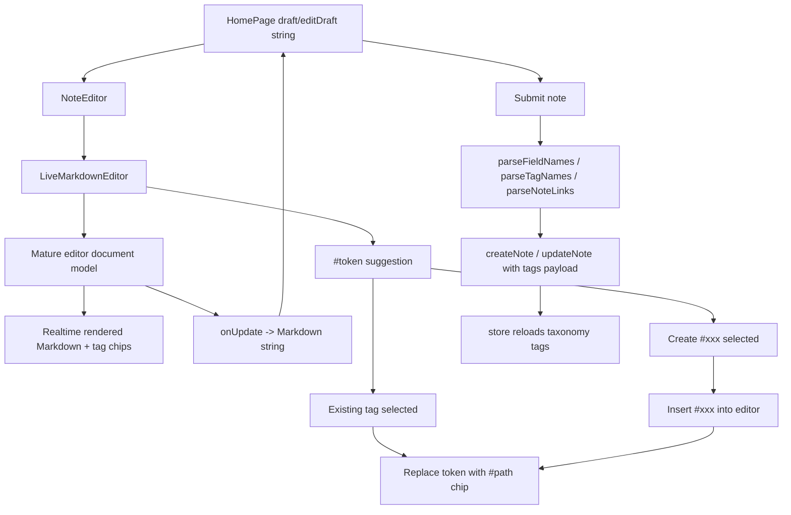

# r019-live-markdown-editor 设计文档

日期：2026-06-26

需求澄清文档：`docs/request-clarify/home-ui/r019-live-markdown-editor.md`

## 核心功能（WHAT）

将首页创建 composer 和 note card 编辑态从原生 `textarea` 升级为成熟库驱动的实时 Markdown 富文本编辑器。编辑器内部实时渲染当前支持的 GFM 样式，并将 `#tag` / `#root/child` 渲染为内联 chip。编辑器对外仍暴露纯 Markdown 字符串，保存时继续复用现有 `parseTagNames()`、`parseFieldNames()` 和 `parseNoteLinks()`，不改变 note create/update 的内容契约。

### 需求背景（WHY）

当前 `NoteEditor` 只能展示 Markdown 源码，用户输入列表、任务列表、强调、引用、代码等内容时缺少实时性。展示态的 `NoteMarkdownContent` 已经能渲染 GFM，但展示态 renderer 不能替代可编辑输入体验。用户明确要求必须使用现成成熟库，完整覆盖当前支持的 Markdown 样式，禁止预览式、局部 tag overlay 或手写 Markdown 编辑器。

### 需求目标（GOAL）

- 创建 composer 和 note card 编辑态使用同一套编辑器组件。
- 编辑器内部实时渲染 GFM 样式和 tag chip。
- 编辑器底层和对外状态保持纯 Markdown 字符串。
- 用户输入的普通换行、空行分段、列表项换行、引用换行和代码块换行必须在编辑态、Markdown 字符串输出和保存后展示态之间保真。
- tag suggestion 在输入至少一个 tag 字符后出现，并支持已有 tag 选择和提交时隐式创建新 tag。
- 新增依赖必须来自成熟编辑器生态，并通过官方文档确认能力。
- 保存 note 的 API 请求体和解析语义保持现有字符串链路。

### 范围边界

| 类型 | 内容 |
| --- | --- |
| In Scope | 用成熟编辑器库替换 `NoteEditor` 内部的 `textarea` 编辑体验。 |
| In Scope | 编辑态实时渲染标题、段落、强调、删除线、无序列表、有序列表、任务列表、引用、分割线、链接、行内代码、代码块和表格。 |
| In Scope | 保留输入框换行语义，避免 Markdown serializer 或编辑器 schema 把用户输入压成单行。 |
| In Scope | 将 `#tag` / `#root/child` 作为编辑器内联 chip 显示，同时保证 Markdown 字符串输出仍包含可解析的 `#path`。 |
| In Scope | tag suggestion 支持完整 path 和当前层级 name 匹配。 |
| In Scope | 无匹配时显示创建项，选中后写入 `#xxx`，提交 note 时通过现有 `tags` payload 隐式创建。 |
| In Scope | 覆盖创建态、编辑态、tag suggestion、隐式创建 tag、Markdown 字符串输出和提交 payload 的测试。 |
| Out of Scope | `textarea + preview`、下方预览行或仅 tag overlay。 |
| Out of Scope | 自研 Markdown parser、手写编辑器核心行为或缩水 Markdown 支持。 |
| Out of Scope | tag 管理页、tag 重命名、移动、删除。 |
| Out of Scope | 后端 schema、数据库或 migration 改动。 |
| Out of Scope | 原始 HTML 执行和额外代码块语法高亮库。 |

## 实现流程（HOW）

### 技术选型

推荐优先选用 Tiptap 作为编辑器基础。Tiptap 官方文档提供 React 集成、Markdown 输入输出、GFM 能力、Mention 扩展和 Suggestion utility，可以把 Markdown 文本、富文本编辑体验和 tag suggestion 放在同一个成熟编辑器体系内处理。Milkdown 是备选，它定位为 Markdown WYSIWYG 编辑器，但与当前 React 组件状态和自定义 tag 创建流程的集成需要在设计实现阶段进一步评估。Lexical 作为第二备选，它提供 Markdown package，但完整 GFM round-trip、tag chip、suggestion 和字符串输出需要更多扩展拼装。

本需求不允许把 `react-markdown` 扩展成可编辑器。`react-markdown` 继续只服务展示态，因为它负责 Markdown 到 React 的只读渲染，不负责输入、selection、composition、undo、富文本编辑模型或 suggestion。

| 方案 | 结论 | 原因 |
| --- | --- | --- |
| Tiptap | 推荐 | React 支持成熟，ProseMirror 编辑模型稳定，官方提供 Mention/Suggestion 和 Markdown 能力，适合用扩展实现 tag chip。 |
| Milkdown | 备选 | Markdown WYSIWYG 方向贴合需求，但需要验证当前项目中 tag suggestion、隐式创建 tag 和纯字符串状态的集成成本。 |
| Lexical | 备选 | 基础能力强，但 Markdown round-trip 与 GFM/tag suggestion 组合需要更多自定义工作。 |
| `textarea + preview` | 禁止 | 不满足文本内部实时渲染。 |
| 自研编辑器 | 禁止 | 用户明确禁止，且会放大 selection、IME、undo、Markdown round-trip 和 accessibility 风险。 |

官方参考：`https://tiptap.dev/docs/editor/markdown/getting-started/basic-usage`、`https://tiptap.dev/docs/editor/extensions/nodes/mention`、`https://tiptap.dev/docs/editor/api/utilities/suggestion`、`https://lexical.dev/docs/packages/lexical-markdown`、`https://milkdown.dev/`。

### 目标组件结构

| 文件 | 设计 |
| --- | --- |
| `src/pages/home/NoteEditor.tsx` | 保留对外组件名和现有 props 语义，内部由 `textarea` 改为新编辑器组件编排，继续负责提交按钮、取消按钮、warning 和工具栏容器。 |
| `src/pages/home/LiveMarkdownEditor.tsx` | 新增编辑器核心组件，封装成熟库初始化、Markdown 输入输出同步、tag extension、suggestion popup 和编辑器 DOM。 |
| `src/pages/home/liveMarkdownEditorUtils.ts` | 放置 tag 候选过滤、tag token 格式化、Markdown 字符串规整等纯函数，不写 Markdown parser。 |
| `src/features/notes/noteStore.ts` | 继续在 note create/update 成功后刷新 taxonomy tags，保证隐式创建的新 tag 进入 sidebar 和后续 suggestion。 |
| `src/pages/home/HomePage.tsx` | 将 `tags` 和必要编辑器配置传给 `NoteEditor`，创建和编辑提交逻辑继续基于字符串解析。 |
| `src/pages/home/NoteCard.tsx` | 编辑态继续复用 `NoteEditor`，展示态继续使用 `NoteMarkdownContent`。 |
| `src/styles/main.css` | 增加编辑器内容区和 suggestion popup 的必要样式，复用当前 CSS token，避免固定视觉测试。 |

### 数据与状态流



`HomePage` 继续持有 `draft` 和 `editDraft` 字符串，避免引入页面级编辑器文档状态。编辑器内部可以有成熟库自己的 document model，但每次内容变化都必须通过官方 Markdown serializer 输出字符串并回写父组件。提交时，现有字符串解析函数仍是 note payload 的唯一来源。

### Markdown 能力映射

| Markdown 能力 | 编辑态要求 |
| --- | --- |
| 标题和段落 | 输入和粘贴 Markdown 后实时显示为对应 block，段落之间的空行必须保留为 Markdown 分段。 |
| 粗体、斜体、删除线 | 作为 inline mark 实时显示，字符串输出保持 Markdown 标记或等价 Markdown。 |
| 无序列表和有序列表 | 输入列表语法后形成列表结构，继续支持多行编辑。 |
| 任务列表 | 显示 checkbox 语义，是否允许直接勾选由编辑器基础能力决定，但输出必须保持 GFM task list 字符串。 |
| 引用和分割线 | 以 block 结构实时显示，引用中的多行内容不能被合并成一行。 |
| 链接 | 显示为链接 mark，输出保持 Markdown link。 |
| 行内代码和代码块 | 实时显示对应 code 样式，不新增语法高亮库，代码块内换行必须逐行保留。 |
| 表格 | 支持基础表格编辑和 Markdown 输出，窄宽度下不能撑破 composer 或 card。 |
| 原始 HTML | 不作为 HTML 执行；如果编辑器库会保留 HTML，需要在设计实现中关闭或转义。 |

### 换行保真策略

实测问题是输入框中的换行没有变成真正换行，保存后笔记文本挤成一团。r019 实现必须把换行作为编辑器选型和序列化的硬约束，而不是样式问题处理。成熟编辑器内部可以用 paragraph、hard break、list item、blockquote 和 code block 等节点表达换行，但对外 Markdown 字符串必须能恢复用户输入的换行语义。

| 场景 | Markdown 输出要求 | 展示态要求 |
| --- | --- | --- |
| 普通两行文本 | 保留可被 Markdown renderer 识别的换行语义，不能输出为 `第一行第二行` | 两行内容在 note card 中可见为换行或独立段落。 |
| 空行分段 | 保留段落之间的空行 | 展示态显示为两个段落。 |
| 多个列表项 | 每个列表项独立输出一行 | 展示态显示为多个 list item。 |
| 引用多行 | 每行引用保留 `>` 语义或等价 Markdown block | 展示态显示为多行引用内容。 |
| 代码块多行 | fenced code block 内保留原始换行 | 展示态代码块逐行显示。 |

实现时需要验证所选编辑器的 Markdown serializer 是否默认折叠 soft break。如果默认折叠，必须使用官方配置、扩展或 serializer 规则保留换行；禁止用提交前简单替换空格、拼接 `<br>` 字符串或手写 Markdown parser 兜底。展示态如需支持普通软换行显示，应在 `NoteMarkdownContent` 的 Markdown 配置或样式层处理，但不能破坏段落、列表、引用和代码块的语义。

### Tag Extension

tag 需要作为编辑器内联 token 处理，视觉上显示 chip，字符串输出中保留 `#path`。推荐用成熟库的 Mention/Suggestion 扩展机制实现一个 `tag` mention 类型，触发字符为 `#`，但必须满足单独 `#` 不弹出，输入至少一个字符后才查候选。

| 行为 | 设计 |
| --- | --- |
| 触发 | 光标处于 `#query` token 内，且 `query.length >= 1`。 |
| 候选来源 | `useNotesStore.tags` 或由 `HomePage` 传入的 `TagDto[]`。 |
| 匹配规则 | `tag.path` 和 `tag.name` 都参与大小写不敏感匹配。 |
| 候选展示 | 已有 tag 显示 `#path`，二级 tag 使用完整 path，保持和保存解析一致。 |
| 无匹配 | 显示 `创建 #query`。 |
| 选择已有 tag | 用完整 `#path` 替换当前 token，并在编辑器内显示 chip。 |
| 创建 tag | 不调用独立接口；选中创建项后把 `#query` 写入编辑器内容并显示 chip。 |
| 创建失败 | 不存在即时创建失败；若 note 提交失败，沿用现有提交失败时保留草稿的行为。 |

### Tag 隐式创建契约

当前实时 OpenAPI 只暴露 `GET /tags?all=true`、note tag 查询和 note tag 关联接口，没有独立 tag 创建接口。r019 改为沿用现有 note create/update 契约：编辑器输出的 Markdown 字符串包含 `#path`，提交前 `parseTagNames(content)` 解析出完整 path，并通过 note create/update 的 `tags` payload 交给后端隐式创建或关联。

note create/update 成功后，现有 store 已刷新 `taxonomyClient.listTags()`，隐式创建的新 tag 会通过该刷新进入 sidebar 和后续 suggestion。实现中禁止新增前端伪 tag 状态作为长期数据源；提交前的临时 chip 只来自编辑器内容本身。

### 与现有保存链路的关系

创建 note 的 `handleCreateSubmit()` 和编辑 note 的 `handleEditSubmit()` 继续接收 Markdown 字符串。提交前仍执行 `parseFieldNames(content)`、`parseTagNames(content)` 和 `parseNoteLinks(content)`。tag chip 不能绕过字符串解析直接维护第二份 tags 状态，避免编辑器显示、字符串内容和提交 payload 三者分叉。

编辑器输出字符串需要满足现有解析规则：tag chip 对应的 Markdown 文本必须包含 `#books/hands-on-gpt` 这类完整 path。若成熟库内部使用 mention node，serializer 必须把该节点输出为 `#path`，而不是隐藏 id、HTML span 或不可解析格式。

编辑器输出字符串还需要满足换行解析规则：普通换行和 Markdown block 边界不能在 `onUpdate -> Markdown string` 过程中丢失。提交前不得对 content 做会破坏换行的全局压缩、空白折叠或 HTML textContent 提取。现有 `content.trim()` 可以继续移除首尾空白，但不能删除正文内部换行。

### UI 布局

`NoteEditor` 外层容器保持当前创建态 floating 和编辑态 embedded 两种视觉上下文。编辑器内容区取代 `textarea`，高度策略继续服务短笔记快速输入：内容少时保持紧凑，内容多时在合理高度内滚动，不撑破首页列表。工具栏仍在编辑器底部，提交和取消按钮保留当前位置。suggestion popup 贴近当前 tag token，层级高于编辑器内容，但不能遮挡提交按钮区域导致无法操作。

移动宽度下，编辑器内容、表格和 suggestion popup 不能溢出视口。表格编辑区域需要横向滚动或使用库提供的可控宽度，不允许把 note card 或 composer 撑出主列。

### i18n

| Namespace | Key | 占位符 | zh-CN | zh-TW | en-US |
| --- | --- | --- | --- | --- | --- |
| `home` | `composer.tagSuggestion.create` | `tag` | 创建 #{{tag}} | 建立 #{{tag}} | Create #{{tag}} |
| `home` | `composer.tagSuggestion.empty` | 无 | 没有匹配标签 | 沒有符合標籤 | No matching tags |
| `home` | `composer.tagSuggestion.error` | 无 | 标签将在保存时创建 | 標籤會在儲存時建立 | Tag will be created on save |

如果最终编辑器库需要额外的可访问名称，例如 suggestion list label 或 tag chip remove label，应放在同一 namespace 下，并补齐三语言资源。用户输入的 note content、tag path、field name 不做翻译。

## 测试用例

| 类型 | 用例 |
| --- | --- |
| 依赖验证 | 新增编辑器依赖后运行安装和 lockfile 更新检查，确认不引入数据库、ORM、Supabase 查询或重型 UI 套件。 |
| 工具函数测试 | tag 候选过滤同时匹配 path 和 name，单独 `#` 不触发候选，`#h` 触发候选。 |
| 组件测试 | 创建 composer 输入列表语法后，编辑器内部出现语义化列表结构。 |
| 组件测试 | 创建 composer 输入普通多行文本后，编辑器输出 Markdown 字符串保留内部换行。 |
| 组件测试 | 输入空行分段后，编辑器输出 Markdown 字符串保留段落边界，展示态显示为分段内容。 |
| 组件测试 | 输入多项列表、引用多行和代码块多行后，Markdown 输出不把内容合并成一行。 |
| 组件测试 | 编辑 note 时加载已有 Markdown 字符串，标题、列表、任务列表、引用、代码和表格进入实时渲染状态。 |
| 组件测试 | 输入 `#h` 后显示 tag suggestion，选择已有 tag 后 Markdown 字符串包含完整 `#path`。 |
| 组件测试 | 无匹配时显示“创建 #xxx”，选择后插入 `#xxx` chip，提交 note payload 的 `tags` 包含 `xxx`。 |
| 提交测试 | 创建和编辑提交仍通过字符串解析生成 tags、field 和 links，payload 不依赖第二份编辑器 tags 状态。 |
| 提交测试 | 提交多行 note 时，请求体 `content` 保留正文内部换行，保存后展示态不把文本挤成一团。 |
| 安全测试 | 原始 HTML 不作为可执行 HTML 插入编辑器输出或展示。 |
| 回归测试 | `NoteMarkdownContent` 展示态继续渲染现有 Markdown note，双链 preview 不受编辑器替换影响。 |
| 编译检查 | `npm run build` 通过。 |
| 自动化回归 | `npm run test` 通过，测试不绑定颜色、间距、固定尺寸、Tailwind class 或编辑器库内部 DOM class。 |
| 手工检查 | 在创建态和编辑态输入列表、任务列表、引用、表格、代码、链接和 tag，确认实时渲染、suggestion、隐式创建 tag 和提交后展示一致。 |

## 补充设计：工具栏按钮实时预览

日期：2026-06-27

r019 初版实现中，工具栏按钮沿用了 Markdown 片段插入链路，点击按钮只向 Tiptap 文档插入普通文本，没有调用编辑器 command，因此按钮生成的内容不会立即变成编辑态实时节点。补充实现推荐复用现有 `ComposerTool` 的 `id` 作为最小行为分派，不新增独立 toolbar service 或额外状态层。`tag` 和 `field` 继续插入 `#`、`@` 文本并同步 Markdown 字符串；`bold` 改为调用 Tiptap mark command，使当前选区或后续输入进入粗体 mark；`list` 改为调用 Tiptap list command，使当前段落进入无序列表结构。所有命令执行后仍通过 `onUpdate -> getMarkdown()` 回写父级 `draft` 或 `editDraft`，保存链路继续只依赖 Markdown 字符串。

```text
工具栏按钮
  -> NoteEditor 按 tool.id 分派
  -> LiveMarkdownEditor 执行 Tiptap command 或文本插入
  -> 编辑器内部实时显示 mark/list/tag 前缀
  -> getMarkdown() 同步纯 Markdown 字符串
```

该补充只修复按钮交互和 Markdown 字符串同步，不调整输入框尺寸、按钮布局、视觉主题或提交 payload 结构。测试应覆盖用户可观察行为：点击加粗后输入文字，编辑器内出现 `strong` 语义且 Markdown 字符串包含粗体标记；点击列表后输入文字，编辑器内出现 list item 语义且 Markdown 字符串包含列表项；点击 tag 和 field 后 Markdown 字符串仍分别插入 `#` 和 `@`。
