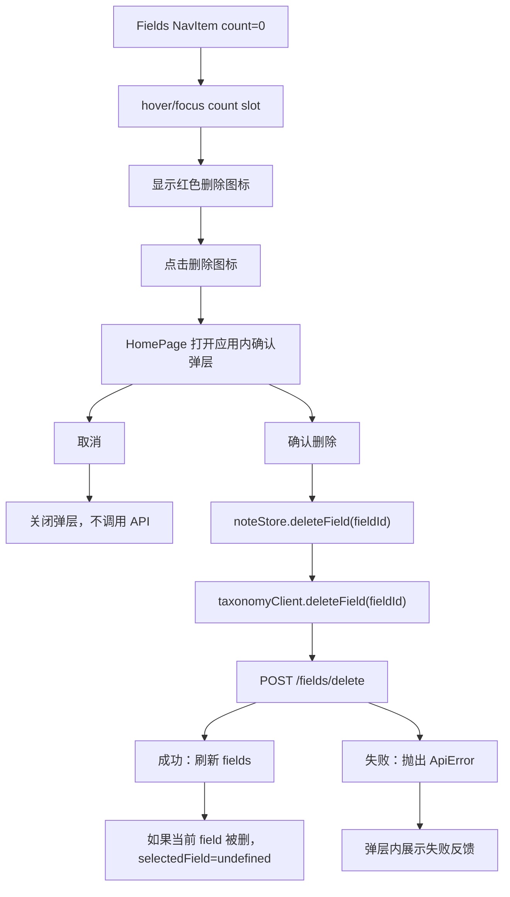

# r020-delete-empty-field 设计文档

日期：2026-06-27

需求澄清文档：`docs/request-clarify/home-ui/r020-delete-empty-field.md`

## 核心功能（WHAT）

在首页左侧 Fields 列表中为 item count 为 0 的 field 增加删除入口。用户把指针移动到右侧数字 `0` 上时，该数字位置切换为红色删除图标；点击后打开应用内确认弹层；确认后调用后端 `POST /fields/delete` 删除 field；删除成功后刷新 field 列表，并在被删除 field 正好是当前筛选项时切回 Fields 的 All。

### 需求背景（WHY）

当前 Fields 侧栏可以展示 field 及其可见 note 数量，也可以用作筛选入口，但没有清理不再使用 field 的能力。后端已经提供只删除 unused field 的接口，前端需要把这个能力接入到现有 Fields 列表里，并保持删除动作在应用内闭环，避免使用浏览器原生确认框破坏当前产品交互一致性。

### 需求目标（GOAL）

- 只对 count 为 0 的 field 提供删除入口，非空 field 不显示删除动作。
- 删除动作以右侧 count 区域为交互入口，hover 数字 `0` 后显示红色删除图标。
- 点击删除图标后显示应用内确认弹层，确认和取消都在应用内完成。
- 确认删除后调用实时 OpenAPI 已确认的 `POST /fields/delete`，请求体包含 `field_id` 和当前 `workspace_id`。
- 删除成功后刷新 fields，当前选中 field 被删除时切回 All。
- 删除失败时保留 field，并显示用户可理解的失败反馈。
- 不影响 Roles、Tags 和 All field 导航项的既有筛选行为。

### 范围边界

| 类型 | 内容 |
| --- | --- |
| In Scope | Fields 列表中 count 为 0 的 field 删除入口。 |
| In Scope | 应用内确认弹层、确认/取消动作和删除中状态。 |
| In Scope | `TaxonomyClient` 增加 `deleteField(fieldId)`，HTTP 实现调用 `/fields/delete` 并携带 workspace scope。 |
| In Scope | `noteStore` 增加 field 删除 action，成功后刷新 fields，必要时切回 All。 |
| In Scope | 删除失败反馈，覆盖 409 和普通 API 错误。 |
| In Scope | API、store、Home UI 和 i18n 测试。 |
| Out of Scope | 删除 count 大于 0 的 field。 |
| Out of Scope | 批量删除、field 重命名、field 合并。 |
| Out of Scope | tag 删除。 |
| Out of Scope | 后端 schema 或接口变更。 |

## 实现流程（HOW）

### 后端契约

实时 OpenAPI 已确认 `POST /fields/delete`，请求体为 `{ "field_id": string, "workspace_id": string }`，成功返回 `{ "field_id": string, "deleted": boolean }`。409 表示 field 仍被 visible notes 使用，前端应把它作为删除失败展示，不应在本地移除 field。请求路径、method 和响应语义以 OpenAPI 为准，不新增或猜测 RESTful `DELETE /fields/{id}` 路径。

| 类型 | 字段 |
| --- | --- |
| `DeleteFieldInput` | `fieldId: string` |
| `DeleteFieldRequest` | `field_id: string`, `workspace_id: string` |
| `DeleteFieldResponse` | `field_id: string`, `deleted: boolean` |

### API Client 设计

`src/api/taxonomy.client.ts` 继续作为 taxonomy 数据访问边界，新增 `deleteField(fieldId: string): Promise<void>`。HTTP client 需要增加 `workspaceId` 配置，复用 `src/api/client.ts` 中已有的 `resolveDefaultWorkspaceId()` 作为默认 workspace scope 来源。`createDefaultTaxonomyClient()` 改为创建 `createTaxonomyHttpClient({ baseUrl, workspaceId })`；test mock client 增加 no-op `deleteField()`，避免测试模式缺方法。

该设计不新增独立 field client。原因是当前 taxonomy client 已负责 fields/tags 查询，删除 unused field 仍属于 taxonomy 资源操作；新增单独 client 只有一个调用点，会增加不必要边界。

### Store 设计

`src/features/notes/noteStore.ts` 增加 `deleteField(fieldId: string): Promise<void>` action。action 调用 `taxonomyClient.deleteField(fieldId)`，成功后重新读取 `taxonomyClient.listFields()` 并写回 `fields`。如果 `get().selectedField === fieldId`，同一次状态更新把 `selectedField` 设为 `undefined`，即切回 Fields 的 All。失败时不改 `fields` 和 `selectedField`，错误向上抛给页面处理。

字段计数仍由 `HomePage` 基于当前 `notes` 计算，不新增后端 field count 状态。删除入口只依赖已有 `fieldUsage.get(field.id) ?? 0`，让 UI 与当前列表可见数据保持一致。

### UI 结构

`HomeSidebar.NavItem` 当前同时承载 roles、fields 和 tags 行。为避免影响非 field 导航，新增可选 props，例如 `deleteLabel?: string`、`deleteDisabled?: boolean`、`onDelete?: () => void`。只有传入 `onDelete` 且 count 为 0 的 field 行才显示删除能力。count 区域从纯 `<span>` 调整为一个稳定宽度的右侧 action slot：默认显示 count，hover/focus 时显示红色 `Trash2` 图标按钮。按钮点击必须 `event.stopPropagation()`，防止触发 field 筛选。

All field 行不传删除 props；Roles 和 Tags 继续使用普通 `NavItem`，不显示删除按钮。为了保持布局稳定，count 文本和删除图标共享同一个右侧 slot，slot 宽度不随 hover 切换变化。

```text
NavItem row
┌────┬──────────────────────┬──────────┐
│ @  │ field name            │ count    │
└────┴──────────────────────┴──────────┘
                                  hover/focus when count = 0
┌────┬──────────────────────┬──────────┐
│ @  │ field name            │ trash    │
└────┴──────────────────────┴──────────┘
```

### 应用内确认弹层

`HomePage` 持有待删除 field 状态，例如 `pendingDeleteField?: FieldDto`、`isFieldDeleting`、`fieldDeleteError`。点击删除图标后设置 `pendingDeleteField` 并打开确认弹层。弹层建议放在 `HomePage` 里实现为小型固定 overlay，复用现有主题 token，包含标题、说明、取消按钮和确认删除按钮。确认按钮在删除中禁用并显示删除中状态；取消按钮关闭弹层并清空错误。

删除失败时弹层保持打开并展示错误反馈。若 `ApiError.status === 409`，展示“该 Field 仍有笔记，不能删除”；其他错误使用后端 message 或通用失败文案。删除成功后关闭弹层、清空错误，并由 store 刷新 fields。

### 状态流



### 日志与错误处理

field 删除属于前后端边界操作，需要在确认删除前、删除成功、删除失败时记录 `console.info` / `console.warn`。日志只记录 field id、field name、错误状态码或错误 code，不记录 token、密钥或其他敏感信息。失败错误由 `ApiError` 透出到页面；页面把错误转成用户文案。

## i18n

| Namespace | Key | 占位符 | zh-CN | zh-TW | en-US |
| --- | --- | --- | --- | --- | --- |
| `home` | `field.delete.action` | `field` | 删除 Field @{{field}} | 刪除 Field @{{field}} | Delete Field @{{field}} |
| `home` | `field.delete.title` | 无 | 删除 Field | 刪除 Field | Delete Field |
| `home` | `field.delete.description` | `field` | 确认删除 @{{field}}？此操作只允许用于没有笔记的 Field。 | 確認刪除 @{{field}}？此操作只允許用於沒有筆記的 Field。 | Delete @{{field}}? This is only allowed for Fields with no notes. |
| `home` | `field.delete.cancel` | 无 | 取消 | 取消 | Cancel |
| `home` | `field.delete.confirm` | 无 | 删除 | 刪除 | Delete |
| `home` | `field.delete.deleting` | 无 | 删除中 | 刪除中 | Deleting |
| `home` | `field.delete.errorInUse` | 无 | 该 Field 仍有笔记，不能删除 | 該 Field 仍有筆記，不能刪除 | This Field still has notes and cannot be deleted |
| `home` | `field.delete.errorGeneric` | 无 | 删除 Field 失败 | 刪除 Field 失敗 | Failed to delete Field |

新增 key 放在 `home.field.delete` 下，避免混入 note 删除文案。字段名不翻译。

## 测试用例

| 类型 | 用例 |
| --- | --- |
| API 单元测试 | `taxonomyClient.deleteField("field-1")` 调用 `POST /fields/delete`，body 包含 `field_id` 和 `workspace_id`。 |
| API 单元测试 | 后端错误时 `deleteField()` 抛出 `ApiError`，保留 status/code/message。 |
| Store 测试或 Home 集成测试 | 删除当前选中的空 field 成功后刷新 fields，并把 `selectedField` 置为 `undefined`。 |
| Home UI 测试 | count 为 0 的 field hover/focus 后出现可访问名称为“删除 Field @xxx”的删除按钮。 |
| Home UI 测试 | count 大于 0 的 field 不出现删除按钮。 |
| Home UI 测试 | 点击删除按钮打开应用内确认弹层，取消后不调用删除 action。 |
| Home UI 测试 | 确认删除成功后弹层关闭，field 从列表消失，All 处于选中状态。 |
| Home UI 测试 | 删除失败时弹层保持打开，显示失败文案，field 仍保留。 |
| i18n 测试 | 三语言资源新增 key 完整。 |
| 编译检查 | `npm run build` 或等价 Node 入口通过。 |
| 回归检查 | `npm run test` 或等价 Node 入口通过，不绑定颜色、间距、固定尺寸或 Tailwind class。 |
