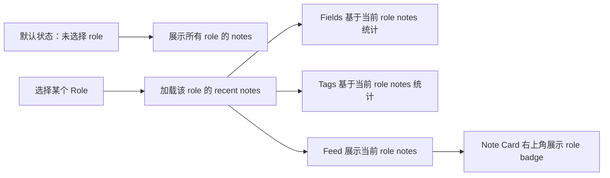

# R014 Role Sidebar 筛选与 Note Card 标识需求澄清

日期：2026-05-30

## 需求理解

本次需求是在首页 sidebar 中增加 `Roles` 分组，并让它与现有 `Fields`、`Tags` 作为同级筛选维度存在。默认状态不选中任何 role，首页展示所有角色创建的笔记；用户可以选择某个 role 来查看该角色创建的笔记，但交互不能强迫用户必须先选择 role。

选择 role 后，当前 note feed 进入该 role 的结果集合，`Fields` 和 `Tags` 也基于该集合重新计算数量和筛选结果。搜索、Field、Tag 继续作为当前 role 集合上的叠加筛选。

同时，note card 右上角需要展示创建角色标识：`Human` 使用人形图标，非 `Human` role 默认按 agent 处理，使用 bot 图标。



## 仓库现状关联

| 位置 | 当前能力 | 本需求关系 |
| --- | --- | --- |
| `src/pages/home/HomePage.tsx` | 首页布局、sidebar、feed、创建和编辑 note 流程 | 增加 `Roles` 分组，接入 role 选择状态，并把 role badge 数据传递给 note card |
| `src/pages/home/HomeSidebar.tsx` | 提供 `SidebarSection` 和 `NavItem`，当前用于 Fields 与 Tags | 复用同级 section 与 nav item 形态渲染 Roles |
| `src/pages/home/NoteCard.tsx` | 展示 note metadata、正文、tag chip 和操作菜单 | 在右上角 metadata 区域增加 role badge |
| `src/pages/home/homeUtils.ts` | 当前负责 feed 过滤、tag/field 计数和解析函数 | 增加 role 计数；现有 Field/Tag 计数保持基于当前 notes 集合 |
| `src/features/notes/noteStore.ts` | 保存 recent notes、Field/Tag 筛选和加载动作 | 增加 `selectedRole`，切换 role 时重新加载 recent notes |
| `src/api/types.ts` | `NoteRecord` 已包含 `role`，但 `NoteDto` 未保留 role | 扩展 `NoteDto.role`，避免映射时丢失后端 role |
| `src/api/notes.client.ts` | `listRecentNotes()` 调用 `POST /notes/recent`，当前只发送 `limit` 和 `note_uuid` | 扩展 `RecentNotesQuery.role`，请求体带上 `role` |

## 后端契约确认

运行中的 `http://localhost:3000/api-docs/openapi.json` 已确认 `POST /notes/recent` 使用 `RecentNotesRequest`，其中包含可选 role 过滤：

| 字段 | 类型 | 说明 |
| --- | --- | --- |
| `limit` | integer/null | 最大返回数量 |
| `note_uuid` | string/null | 分页 cursor |
| `role` | string/null | 可选 note creator role filter |

`NoteRecord` 响应中已包含必填 `role: string`。创建 note 的 `CreateNoteRequest.role` 也是字符串；当前 Web 创建 note 时默认传 `Human`。

## 范围确认

### In Scope

| 功能 | 说明 |
| --- | --- |
| Roles sidebar section | 在 sidebar 增加 `Roles` 分组，与 `Fields`、`Tags` 平级 |
| 默认展示全部 role | 初始 `selectedRole` 为空，不强迫用户选择 role |
| Role 筛选 | 点击具体 role 后，通过 `POST /notes/recent` 传入 `role` 拉取该角色 notes |
| 清空 role 筛选 | `Roles` 中提供 `全部` nav item，点击后恢复所有 role notes |
| Fields/Tags 联动 | 选择 role 后，Fields 和 Tags 的计数基于当前 role notes 重新计算 |
| 筛选叠加 | 搜索、Field、Tag 继续在当前 role notes 上叠加过滤 |
| Note card role badge | note card 右上角展示 role 文本和图标 |
| Human 图标 | 严格等于 `Human` 时使用人形图标 |
| Agent 图标 | 非 `Human` role 默认使用 bot 图标 |
| i18n | 补齐 Roles、全部、Unknown 等必要文案 |
| 测试 | 覆盖 API payload、DTO role 映射、role 计数、sidebar 筛选和 note card badge 行为 |

### Out of Scope

| 功能 | 原因 |
| --- | --- |
| 创建 note 时选择 role | 本轮只展示和筛选既有 role，创建仍沿用 `Human` |
| role 管理页面 | 后端当前没有角色列表或管理接口 |
| 权限控制 | 本需求是展示和筛选，不涉及访问控制 |
| 后端接口修改 | 当前 OpenAPI 已提供所需字段 |
| 固定角色枚举 | 当前没有后端枚举来源，本轮从 notes 数据中统计 role |

## 交互形态

推荐 sidebar 结构如下：

```text
Sidebar
├─ Stats / Heatmap
├─ Roles
│  ├─ 全部      50
│  ├─ Human     31
│  ├─ Agent     19
│  └─ ...
├─ Fields
│  ├─ 全部      当前 role 下的笔记数
│  ├─ inbox     当前 role 下的 inbox 数
│  └─ ...
└─ Tags
   ├─ product   当前 role 下的 tag 数
   └─ ...
```

Note card 右上角结构如下：

```text
┌──────────────────────────────────────┐
│ 2026-05-30 10:12      [person Human] │
│                                      │
│ note content...                      │
└──────────────────────────────────────┘
```

非 `Human` role 使用 bot 图标：

```text
┌──────────────────────────────────────┐
│ 2026-05-30 10:12        [bot Agent]  │
│                                      │
│ note content...                      │
└──────────────────────────────────────┘
```

## 已确认决策

| 问题 | 决策 |
| --- | --- |
| Role 名称判断 | 只有严格等于 `Human` 时使用人形图标，其他全部使用 bot 图标 |
| Roles 列表来源 | 从当前所有 role recent notes 结果中统计 |
| Role section 位置 | 放在 `Fields` 上方 |
| 默认状态 | 不选 role，展示所有 role notes |
| Role 选择是否必需 | 不是必选项，用户可以一直保持全部 role 状态 |
| 后端筛选方式 | 选择 role 后调用 `POST /notes/recent` 并携带 `role` |

## 验收标准

| 编号 | 验收项 |
| --- | --- |
| A1 | 首页初始进入时未选中具体 role，feed 显示所有 role 的 recent notes |
| A2 | Sidebar 中 `Roles` 与 `Fields`、`Tags` 同级展示，且位于 `Fields` 上方 |
| A3 | 点击某个 role 后，`POST /notes/recent` 请求体包含该 `role` |
| A4 | 点击 `Roles` 下的 `全部` 后，`POST /notes/recent` 不传具体 `role` |
| A5 | 选中 role 后，Fields 和 Tags 的计数基于当前 role notes 变化 |
| A6 | 选中 role 后，搜索、Field、Tag 仍能继续叠加过滤 feed |
| A7 | `Human` note card 右上角显示人形图标和 `Human` 文本 |
| A8 | 非 `Human` note card 右上角显示 bot 图标和对应 role 文本 |
| A9 | 后端返回空或异常 role 时，UI 使用稳定 fallback 文案，不破坏 card 布局 |
