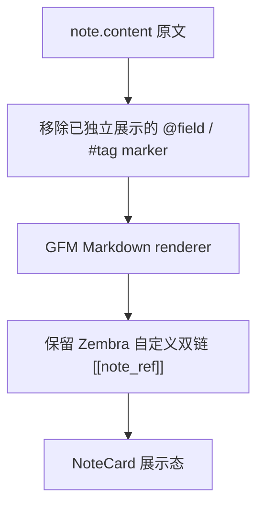

# r017-note-card-markdown-rendering 需求澄清

日期：2026-06-12

## 需求背景

当前 NoteCard 展示态未正确渲染 Markdown。用户在浏览器中选中的 note 内容包含 Markdown 列表语法，但卡片正文只是按普通文本显示 `- `，没有形成列表结构。

本需求作为新功能处理，不做轻量 parser，不针对单条 note 或单个 case 修补。

## 需求目标

在首页 NoteCard 展示态中实现完整 Markdown 渲染，让用户保存的 Markdown-compatible note content 能以稳定、语义化、可读的形式展示。

## 已确认决策

| 决策项 | 结论 |
| --- | --- |
| Markdown 标准 | 使用 GFM。 |
| Renderer 策略 | 引入成熟 Markdown renderer，避免重复造轮子。 |
| HTML 策略 | 不渲染原始 HTML。 |
| 外部链接 | 可点击，并在新窗口打开。 |
| 代码展示 | 只做行内代码高亮样式，不考虑完整代码段语法高亮。 |

## 范围边界

### In Scope

| 范围 | 说明 |
| --- | --- |
| NoteCard 展示态 Markdown 渲染 | 所有 note card 正文按 GFM 渲染，不只修复当前列表 case。 |
| GFM 常用结构 | 支持段落、标题、强调、删除线、列表、任务列表、引用、表格、分割线、链接、行内代码和代码块的基础结构渲染。 |
| Zembra 双链 | 保留 `[[note_ref]]` 自定义语法，继续展示短链按钮和 hover preview。 |
| Tag / Field 去重 | 继续移除正文中已被 metadata 或 chip 独立展示的 `@field`、`#tag` marker。 |
| 展开折叠 | Markdown 渲染后的内容继续支持当前 NoteCard 的折叠和展开能力。 |
| 链接安全 | Markdown 链接新窗口打开，并使用安全的 `rel` 属性。 |
| 行内代码样式 | 行内代码需要有清晰的视觉高亮，符合当前卡片视觉语言。 |
| 测试覆盖 | 验证用户可观察行为和语义结构，不绑定静态 Tailwind class 或具体样式值。 |

### Out of Scope

| 范围 | 说明 |
| --- | --- |
| Markdown 编辑器 | 本轮不引入富文本编辑器、实时预览编辑器或编辑态 Markdown preview。 |
| 后端存储变更 | `note.content` 仍保存原始文本，不改变 API 或数据库契约。 |
| 自研 Markdown parser | 不手写轻量 Markdown parser，不为某个截图内容做特判。 |
| 原始 HTML 渲染 | 即使 Markdown 内容包含 HTML，也不作为 HTML 注入页面。 |
| 完整代码段高亮 | 代码块可按 Markdown 结构展示，但不引入语法高亮能力。 |

## 依赖边界

本需求允许新增成熟 Markdown 渲染依赖，但依赖必须满足：

- 不引入 SQLite driver、ORM、数据库 migration 运行时或组件内 Supabase 查询能力。
- 不改变 API Client、Repository 或 feature 层的数据访问边界。
- 不作为重型 UI 套件引入。
- 生产包体影响需要在设计阶段说明。

## 验收标准

| 场景 | 期望 |
| --- | --- |
| `- item` / 多行列表 | 渲染为语义化列表，不显示成普通短横线文本。 |
| `**bold**`、`*italic*`、`~~delete~~` | 渲染为对应 Markdown 强调语义。 |
| `[label](https://example.com)` | 渲染为可点击链接，新窗口打开。 |
| HTML 输入 | 不作为 HTML 执行或插入页面。 |
| `` `inline code` `` | 渲染为有区分度的行内代码样式。 |
| `[[note_ref]]` | 继续渲染为短链按钮，并保留 hover preview。 |
| `@field` / `#tag` marker | 已独立展示的 marker 不在正文重复出现。 |
| 折叠卡片 | Markdown 内容在折叠状态下不破坏卡片布局，展开后显示完整内容。 |
