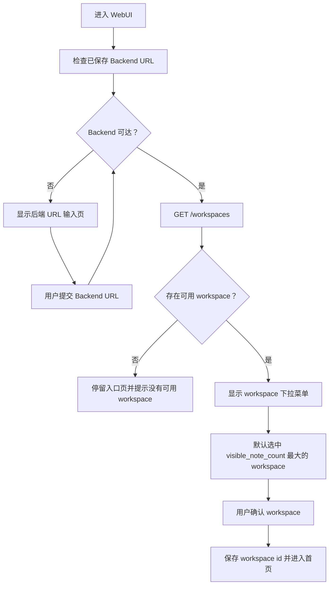

# r018-login-workspace-selector 需求澄清

日期：2026-06-26

## 需求背景

引入 workspace id 后，前端不能继续在未确认 workspace 的情况下直接进入首页。当前入口页只负责配置后端 URL 并检查后端可达性；后端可达后，前端需要先从 `GET /workspaces` 获取可用 workspace 列表，让用户选择本次进入首页使用的 workspace。

## 需求目标

登录入口在后端 URL 可达后增加 workspace 选择步骤。workspace 下拉菜单展示当前所有可用 workspace 的名称和笔记条目数；没有名称的 workspace 使用 workspace id 前八位 hash 作为展示名。默认选中笔记数量最多的 workspace，用户确认后进入首页，后续笔记相关 API 请求使用选中的 workspace id。

## 登录页布局示意

入口页保留当前居中窄表单结构，在同一个登录卡片区域内按状态展示后端 URL 输入和 workspace 选择。后端 URL 未确认或不可达时，只展示 URL 输入；后端 URL 可达后，展示 workspace 下拉菜单和进入按钮。

```text
状态 A：需要配置或重新配置后端 URL

┌────────────────────────────────────────┐
│ Zembra                                 │
│ 连接到你的本地 Zembra Backend。        │
│                                        │
│ ┌──────────────────────┐ ┌──────────┐ │
│ │ Backend host         │ │ Port     │ │
│ └──────────────────────┘ └──────────┘ │
│                                        │
│ [ 连接后端 ]                           │
│                                        │
│ 后端不可达时，这里显示错误提示。       │
└────────────────────────────────────────┘
```

```text
状态 B：后端可达，需要选择 workspace

┌────────────────────────────────────────┐
│ Zembra                                 │
│ 选择本次要进入的 workspace。           │
│                                        │
│ Backend                                │
│ 127.0.0.1:3000                         │
│                                        │
│ Workspace                              │
│ ┌────────────────────────────────────┐ │
│ │ 产品笔记                      128 │ │
│ └────────────────────────────────────┘ │
│                                        │
│ [ 进入 Zembra ]                        │
│                                        │
│ workspace 为空或加载失败时，这里提示。 │
└────────────────────────────────────────┘
```

```text
下拉展开示意

┌────────────────────────────────────────┐
│ Workspace                              │
│ ┌────────────────────────────────────┐ │
│ │ 产品笔记                      128 │ │
│ ├────────────────────────────────────┤ │
│ │ 产品笔记                      128 │ │
│ │ 9f2a81bc                       24 │ │
│ │ Research                        0 │ │
│ └────────────────────────────────────┘ │
└────────────────────────────────────────┘
```

| UI 区域 | 需求 |
| --- | --- |
| 标题区 | 保留 `Zembra` 品牌标题，说明文案根据当前状态切换。 |
| 后端 URL 表单 | 仅在需要配置后端 URL 时作为主要输入区域展示。 |
| 已确认后端信息 | 进入 workspace 选择态后展示当前后端地址，避免用户不知道 workspace 来源。 |
| workspace 下拉 | 单选下拉菜单，选项右侧展示笔记条目数。 |
| workspace 展示名 | 优先展示 `workspace_name`，为空时展示 `workspace_id.slice(0, 8)`。 |
| 主按钮 | URL 输入态为“连接后端”，workspace 选择态为“进入 Zembra”。 |
| 错误区 | 后端不可达、workspace 为空、workspace 加载失败、已保存 workspace 失效都在表单内显示明确提示。 |



## 仓库现状关联

当前入口页由 `src/app/BackendUrlGate.tsx` 实现，负责输入后端 host/port、检查 `GET /health`、保存 backend URL，然后直接渲染应用内容。workspace 响应类型已存在于 `src/api/types.ts`，字段包括 `workspace_id`、`workspace_name`、`short_hash`、`visible_note_count` 和 `latest_note_created_at`。当前 `src/api/client.ts` 在没有 `VITE_ZEMBRA_WORKSPACE_ID` 时会调用 `GET /workspaces` 并取返回列表第一项作为默认 workspace，这需要调整为登录入口显式选择并持久化用户选择。

## 已确认决策

| 决策项 | 结论 |
| --- | --- |
| workspace 选择持久化 | 使用 `localStorage` 持久化选中的 workspace id。 |
| 默认选择 | `GET /workspaces` 返回列表中默认选中 `visible_note_count` 最大的 workspace。 |
| 展示名 | 优先使用 `workspace_name`；没有 name 时显示 workspace id 前八位 hash。 |
| 笔记条目数 | 下拉选项需要同时展示该 workspace 的 `visible_note_count`。 |
| 空列表处理 | `GET /workspaces` 返回空列表时不进入首页，停留入口页并提示没有可用 workspace。 |
| 已保存 workspace 失效 | 如果本地保存的 workspace id 不在最新 `GET /workspaces` 结果中，清空选择并回到登录入口让用户重新选择。 |

## 范围边界

### In Scope

| 范围 | 说明 |
| --- | --- |
| workspace 列表加载 | 后端 URL 可达后调用 `GET /workspaces` 获取可用 workspace。 |
| workspace 下拉菜单 | 在入口页增加 workspace 下拉选择控件，展示 workspace 名称或前八位 hash 以及笔记条目数。 |
| 默认值选择 | 没有有效持久化选择时，默认选中笔记数量最多的 workspace。 |
| 持久化选择 | 用户确认进入首页后，将 workspace id 保存到浏览器本地配置。 |
| 已保存选择校验 | 后续进入时重新读取 `GET /workspaces`，确认保存的 workspace id 仍然存在。 |
| 失效回退 | 已保存 workspace id 失效时清空本地选择，显示 workspace 选择入口。 |
| 笔记 API scope | 首页笔记相关请求使用当前选中的 workspace id。 |
| 错误与空状态 | workspace 列表加载失败或为空时，不进入首页，并展示可理解的错误或空状态提示。 |
| 测试覆盖 | 覆盖 workspace 列表展示、默认选择、持久化、失效回退、空列表阻止进入首页和笔记 API 使用选中 workspace。 |

### Out of Scope

| 范围 | 说明 |
| --- | --- |
| workspace 管理 | 本轮不实现创建、重命名、删除 workspace。 |
| 首页内切换 workspace | 本轮只在登录入口选择 workspace，不在首页增加全局切换器。 |
| 用户账号登录 | 本轮不引入账号、密码、token 或权限校验。 |
| 后端契约变更 | 以前端消费现有 `GET /workspaces` 契约为目标，不修改数据库或后端 schema。 |
| workspace 数据迁移 | 本轮不处理已有笔记跨 workspace 迁移。 |

## 验收标准

| 场景 | 期望 |
| --- | --- |
| 后端 URL 可达且存在 workspace | 入口页显示 workspace 下拉菜单，用户确认后进入首页。 |
| workspace 有 name | 下拉选项展示该 name 和笔记条目数。 |
| workspace 没有 name | 下拉选项展示 workspace id 前八位 hash 和笔记条目数。 |
| 多个 workspace | 默认选中 `visible_note_count` 最大的 workspace。 |
| 用户选择 workspace 并进入首页 | 选中的 workspace id 保存到 `localStorage`。 |
| 后续访问且保存的 workspace 仍存在 | 默认使用已保存 workspace。 |
| 后续访问但保存的 workspace 不存在 | 清空本地 workspace 选择，停留入口页让用户重新选择。 |
| `GET /workspaces` 返回空列表 | 不进入首页，显示没有可用 workspace 的提示。 |
| `GET /workspaces` 加载失败 | 不进入首页，显示加载失败提示并允许用户重新尝试。 |
| 首页笔记请求 | note CRUD、recent notes、daily counts 和 note preview 等请求携带当前选中的 workspace id。 |
